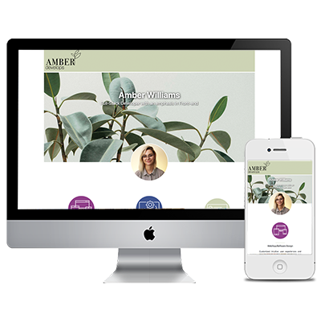

### App screen shots

### Running App

1. Clone repository
2. cd into app and run `yarn`
3. To run development server locally run  `yarn dev`
4. (Optional) To run build locally run `yarn build && yarn start`

### About the application
Used Airbnb’s linter, prettier for formatting, unit testing and added Bootstrap to make faster iteration. The linter, prettier and tests run on commit hooks for reliable automation when adding updates to the app.

The Next app also uses dynamic routing so that each item created from the full list of case study data can be used to fetch more information about that item using its id and sending the user to the individual item page.
